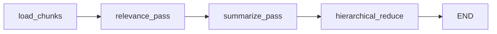

## Context

Sleuths today is a Rust CLI (`.cursor/skills/sleuths/sleuth/`) that orchestrates a fixed map-reduce pipeline in imperative code (`refresh.rs`, `pipeline.rs`). Stages — chunk streaming, relevance filtering, batched summarization, hierarchical reduce, checkpoint persistence — are plain functions with token-budget batching helpers. Inference is HTTP to Ollama or OpenAI-compatible chat endpoints configured in gitignored `.sleuths/config.yaml`.

The living `conversation-sleuths` spec defines externally observable behavior (incremental refresh, checkpoints, reset, privacy, batching semantics). Implementation language is not specified. This change swaps the implementation for Python + LangGraph while preserving on-disk artifacts and CLI semantics, and adds opt-in LangSmith tracing.

## Goals / Non-Goals

**Goals:**

- Parity with current Rust behavior for `refresh` and `reset`, `.sleuths/` layout, checkpoint granularity, transcript discovery, and map-reduce semantics.
- Express the per-segment pipeline as an explicit LangGraph `StateGraph` with typed state so stages are composable and visible in traces.
- Wire LangSmith when the operator fills in local secret stubs; default remains fully local with no cloud export.
- Ship committed secret **stubs only** (example env file); real credentials stay gitignored.
- Update bundle docs and install path so consumers install Python deps instead of `cargo build`.

**Non-Goals:**

- Changing lens YAML shape, summary markdown format, or checkpoint schema (unless a parity bug forces a fix during port).
- Automatic background refresh, team-shared sleuths, or cloud transcript sync.
- Replacing the configured inference endpoint with a hosted model bundled in the repo.
- Requiring LangSmith for refresh to succeed.
- Keeping the Rust implementation alongside Python long-term.

## Decisions

### 1. Python packaging — `pyproject.toml` + editable install

Place the Python package at `.cursor/skills/sleuths/` with `pyproject.toml` and a `sleuth` console script entry point (`sleuth refresh`, `sleuth reset`).

```bash
# one-time per machine (from repo root)
python -m pip install -e .cursor/skills/sleuths
```

**Rationale:** Standard Python distribution; no Rust toolchain required. Editable install keeps skill source authoritative.

**Alternative considered:** `uv`/`poetry` lockfiles — acceptable follow-up; start with `pyproject.toml` + pip for minimal bundle surface.

### 2. LangGraph topology — outer orchestration + per-segment subgraph

**Outer loop (Python, mirrors `refresh.rs`):** load config/query → discover segments → filter pending work → for each segment invoke graph → merge segment outputs → recursive reduce with prior summary seed → write `summary.md` + checkpoint.

**Per-segment `StateGraph`:**



| Node | Responsibility | Rust equivalent |
|------|----------------|-----------------|
| `load_chunks` | Stream JSONL tail into indexed chunks | `stream_chunks` |
| `relevance_pass` | Batch by token budget; LLM JSON id filter | `run_relevance_pass` |
| `summarize_pass` | Batch relevant chunks; emit pass summaries | `run_summarize_pass` |
| `hierarchical_reduce` | Recursive merge to final target | `recursive_reduce` |

Batching loops remain **inside** nodes (same as Rust) to avoid graph explosion on large sessions. LangSmith still sees stage boundaries per node.

**State (`TypedDict`):** `query`, `processing`, `segment_path`, `session_tag`, `start_line`, `end_line`, `chunks`, `relevant_chunks`, `pass_summaries`, `segment_summary`, plus shared `inference_client` / config handles in graph config or state.

**Alternative considered:** One graph node per batch — finer traces but noisy graphs and harder checkpointing; rejected for v1 port.

### 3. Inference — LangChain chat models with existing HTTP backends

Use `langchain_community` / `langchain_ollama` (or thin custom `BaseChatModel`) to call:

- Ollama `POST /api/generate` (prompt mode) **or**
- OpenAI-compatible `POST /v1/chat/completions`

Map existing `config.yaml` `api` field to the appropriate client. Prompt text ports verbatim from `prompts.rs`.

**Rationale:** LangGraph nodes call `.invoke()` on a shared model; LangSmith automatically traces LLM calls when tracing is enabled.

### 4. LangSmith — env-based, opt-in, loaded from local secrets file

Committed stub: `.cursor/skills/sleuths/secrets.example.env`

```dotenv
# Copy to .sleuths/secrets.env (gitignored) and fill in values.
LANGCHAIN_TRACING_V2=true
LANGCHAIN_ENDPOINT=https://api.smith.langchain.com
LANGSMITH_API_KEY=<your-langsmith-api-key>
LANGSMITH_PROJECT=sleuths
# Optional: distinguish runs per machine or repo
# LANGSMITH_WORKSPACE_ID=
```

At CLI startup, if `.sleuths/secrets.env` exists, load it with `python-dotenv` (do not error if missing). Set standard LangChain tracing env vars before graph compilation/invoke.

Use `@traceable` or LangGraph's built-in LangSmith integration so each graph node appears as a span; LLM calls nest underneath.

**Rationale:** Matches LangChain ecosystem conventions; operator fills one local file; no secrets in git.

**Alternative considered:** LangSmith API key in `config.yaml` — rejected; keeps secrets separate from inference config and matches project `.env` patterns in `AGENTS.md`.

### 5. On-disk compatibility — preserve `.sleuths/` contract

No schema migration:

- `.sleuths/config.yaml` — unchanged keys (`ollama`, `transcripts`, `processing`)
- `.sleuths/queries/<id>.yaml` — unchanged
- `.sleuths/<id>/checkpoint.yaml` — unchanged `(transcript_id, relative_path, line_count)`
- `.sleuths/<id>/summary.md` — unchanged header/body merge rules

Python port reads/writes the same YAML and markdown shapes the Rust tool uses today.

### 6. Remove Rust crate; extend local tools install script

- Delete `.cursor/skills/sleuths/sleuth/` (Cargo crate) and `Cargo.toml` workspace at skill root.
- Update `scripts/build-local-tools.sh` to install Python skill packages (editable `pip install -e`) when `pyproject.toml` is present, and retain Rust build loop only if other crates remain.
- Remove `.cursor/skills/sleuths/target/` gitignore entry if no Rust target remains.

**Rationale:** Single implementation path; avoids dual maintenance.

### 7. Skill and agent docs

Update `.cursor/skills/sleuths/SKILL.md`:

- Python 3.11+ prerequisite
- `pip install -e` (or updated build script) instead of `cargo build`
- Optional LangSmith setup via `secrets.example.env` → `.sleuths/secrets.env`
- Same human-gated refresh/reset flows

Update `AGENTS.md` sleuths section and `openspec-flow-install` inventory accordingly.

### 8. Testing strategy

- Port existing Rust unit-test scenarios to `pytest` where they cover pure logic (slug derivation, token budget grouping, relevance JSON parsing, checkpoint round-trip).
- Smoke test: refresh against configured inference endpoint; second refresh is incremental; reset clears checkpoint.
- Optional smoke: with `secrets.env` filled, confirm a run appears in LangSmith project dashboard.

## Risks / Trade-offs

| Risk | Mitigation |
|------|------------|
| Python/LangGraph dependency weight vs lean Rust binary | Document one-time `pip install -e`; pin versions in `pyproject.toml` |
| Behavioral drift during port | Parity checklist against Rust tests and living spec scenarios; keep prompts identical initially |
| LangSmith exports transcript-derived prompts (privacy) | Opt-in only; document in skill that enabling tracing sends LLM inputs to LangSmith cloud |
| LangSmith outage blocks refresh | Tracing failures are non-fatal; refresh depends only on inference endpoint |
| Inference latency unchanged | Same HTTP backends and batching; graph overhead should be negligible |

## Migration Plan

1. Land Python package behind same CLI commands; verify parity on a real project with existing `.sleuths/` state.
2. Update skill/docs/build script; remove Rust sources.
3. Consumer migration: run new install step once; existing summaries/checkpoints continue working.
4. Operators who want LangSmith: copy `secrets.example.env` → `.sleuths/secrets.env` and fill API key + project.

**Rollback:** Revert bundle commit; reinstall prior OSF bundle version with Rust sleuth; `.sleuths/` artifacts remain compatible either way.

## Open Questions

- Pin LangGraph/LangChain minor versions at apply time to whatever is current stable in mid-2026.
- Whether `build-local-tools.sh` should prefer `uv sync` when `uv` is on PATH — decide during apply.
- Exact LangSmith project naming convention for multi-repo operators (default `sleuths` vs include slug).
